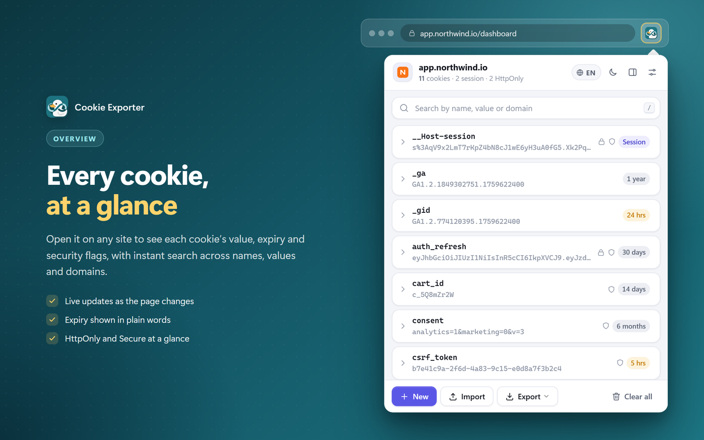
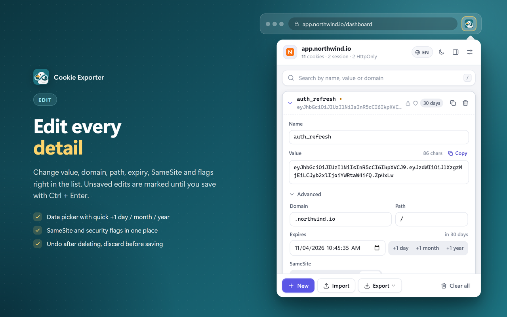
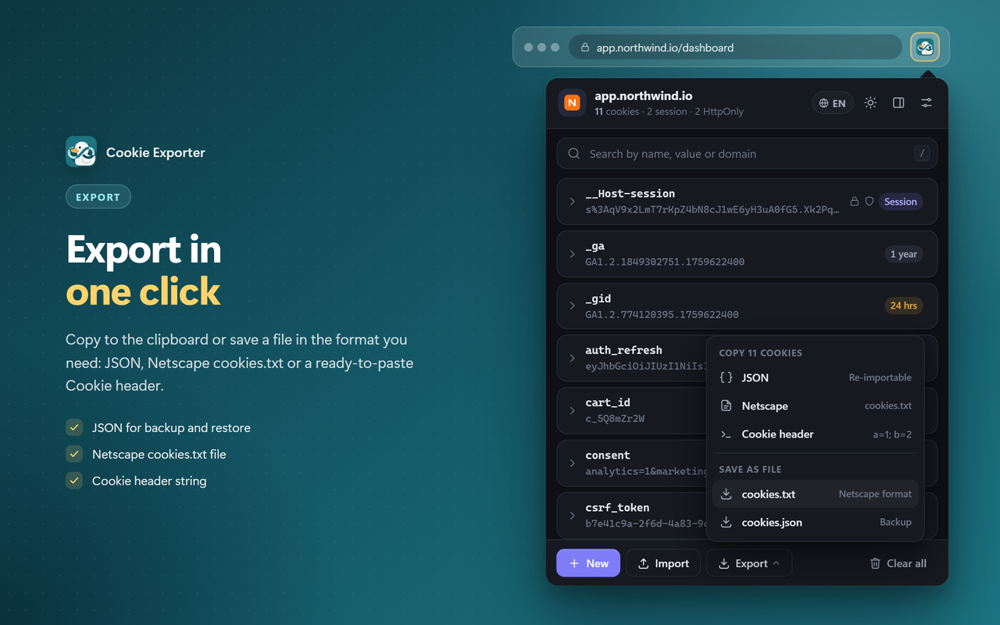
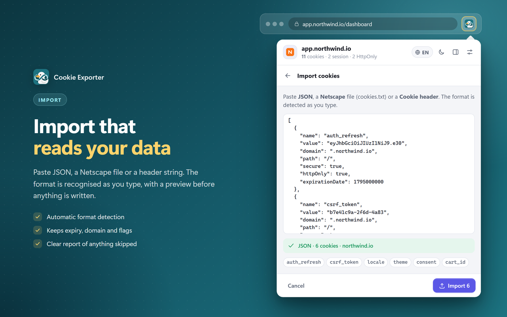
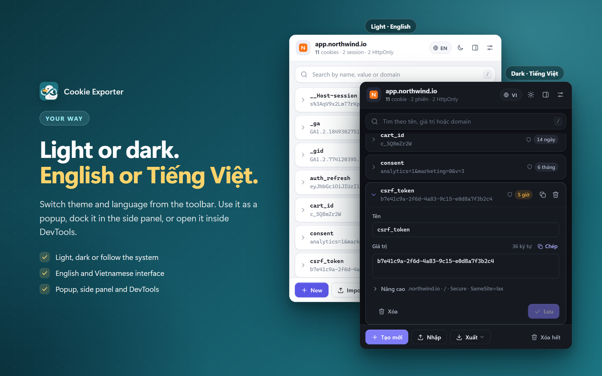

<h1 align="center">Cookie Exporter</h1>

<b>Tiện ích Chrome miễn phí để xem, tìm, sửa, tạo, xóa, nhập và xuất cookie của trang đang mở — dạng JSON, Netscape cookies.txt hoặc chuỗi Cookie header.</b>

  

---

## Cài đặt

### Bước 1 — Cài từ Chrome Web Store

1. Mở trang **[Cookie Exporter trên Chrome Web Store](https://chromewebstore.google.com/detail/cookie-exporter/fhnmmidekmgocpjdceeffppcodigillk)**.
2. Bấm **Thêm vào Chrome** (Add to Chrome) → **Thêm tiện ích**.
3. Bấm biểu tượng mảnh ghép trên thanh công cụ và **ghim** Cookie Exporter (biểu tượng chú vịt) để mở nhanh.

Tiện ích cần Chrome bản **102 trở lên** và tự cập nhật qua Chrome Web Store.

### Bước 2 — Miễn phí, không cần tài khoản

Cookie Exporter **miễn phí**: không tài khoản, không quảng cáo, không theo dõi hay thống kê. Mọi thứ chạy ngay trong trình duyệt của bạn.

---

## Lần chạy đầu tiên

1. **Mở trang web** bạn cần xem cookie.
2. **Bấm biểu tượng Cookie Exporter** trên thanh công cụ. Popup hiện tên trang, số cookie, số cookie phiên và số cookie HttpOnly.
3. **Cấp quyền đọc cookie** (chỉ lần đầu): bấm **Cho phép trang này** (chỉ trang đang mở) hoặc **Cho phép mọi trang**. Quyền này tùy chọn và thu hồi được bất cứ lúc nào trong `chrome://extensions`.
4. **Xem, sửa, xuất hoặc nhập** cookie bằng các nút ở thanh dưới: **Tạo mới · Nhập · Xuất · Xóa hết**.

Giao diện mặc định là tiếng Anh — bấm nút **EN** trên thanh trên cùng để chuyển sang **Tiếng Việt**.

---

## Tính năng

- **Nhìn là thấy hết** — toàn bộ cookie của trang trong một danh sách, kèm giá trị, hạn dùng ghi bằng lời ("30 ngày", "Phiên", "Hết hạn" — rê chuột để xem ngày giờ chính xác) và dấu HttpOnly / Secure trên từng dòng.
- **Tìm tức thì** — theo tên, giá trị hoặc domain, có tô sáng chỗ khớp. Danh sách tự cập nhật khi trang thêm hay xóa cookie.
- **Sửa từng chi tiết** — tên, giá trị, domain, path, hạn dùng, SameSite, Host only, Session, Secure, HttpOnly; **Ctrl + Enter** để lưu.
- **Xuất một cú bấm** — chép vào clipboard dạng JSON, Netscape hoặc Cookie header, hoặc lưu thành file `.txt` / `.json`.
- **Nhập tự nhận định dạng** — dán JSON, Netscape cookies.txt hoặc Cookie header, có xem trước trước khi ghi.
- **Hoàn tác** — sau khi xóa một cookie hoặc xóa hết cookie của trang.
- **Ba cách mở** — popup trên thanh công cụ, bảng bên (side panel) hoặc tab **Cookie** trong DevTools (F12).
- **Sáng / tối / theo hệ thống**, giao diện **Tiếng Việt** và **English**.
- **Dùng bằng bàn phím** — `/` để tìm, phím mũi tên để di chuyển, `Esc` để quay lại.

---

## Các trang

### 📋 Danh sách cookie

Mỗi dòng là một cookie: tên, giá trị (rút gọn), biểu tượng HttpOnly / Secure và nhãn hạn dùng (Session, 24 giờ, 30 ngày, 1 năm…). Thanh trên cùng hiện tên trang, số cookie và các nút **ngôn ngữ**, **sáng/tối**, **mở trong bảng bên** và **Cài đặt**. Ô tìm kiếm lọc ngay khi gõ.

### ✏️ Sửa cookie

Bấm vào một cookie để mở ngay trong danh sách. Sửa **Tên** và **Giá trị** (có đếm ký tự và nút **Chép**); mục **Nâng cao** chứa Domain, Path, **Hết hạn** (lịch chọn ngày + nút nhanh **+1 ngày / +1 tháng / +1 năm**), SameSite và các cờ Session, Host only, Secure, HttpOnly. Cookie có thay đổi chưa lưu được đánh dấu chấm màu; bấm **Bỏ thay đổi** để hủy hoặc **Lưu** (Ctrl + Enter) để ghi. Nút **Tạo mới** tạo cookie với giá trị mặc định cho trang hiện tại.

### 📤 Xuất

Nút **Xuất** mở menu hai nhóm:

| Nhóm | Lựa chọn | Dùng khi |
|---|---|---|
| **Chép vào clipboard** | **JSON** | Sao lưu, nhập lại được |
| | **Netscape** | Định dạng cookies.txt |
| | **Cookie header** | Chuỗi `a=1; b=2` |
| **Lưu thành file** | **cookies.txt** | File định dạng Netscape |
| | **cookies.json** | File sao lưu JSON |

File được tải về thư mục tải xuống của trình duyệt với tên theo trang, ví dụ `labs.google_cookies.json`.

### 📥 Nhập

Bấm **Nhập**, rồi dán **JSON**, file **Netscape** (cookies.txt, kể cả dòng `#HttpOnly_`) hoặc **Cookie header**. Định dạng được nhận ra ngay khi bạn dán; tiện ích hiện định dạng, số cookie và tên từng cookie trước khi ghi. Hạn dùng, domain, path và các cờ được giữ nguyên; Cookie header được thêm cho trang đang mở. Cookie không nhập được (ví dụ đã hết hạn) được báo rõ.

### 🎨 Giao diện, ngôn ngữ, bảng bên &amp; DevTools

Đổi **sáng / tối** và **EN / VI** ngay trên thanh trên cùng của tiện ích. Bấm nút **Mở trong bảng bên** để ghim tiện ích vào side panel của Chrome — danh sách đổi theo tab bạn đang xem. Trong DevTools (F12) có thêm tab **Cookie** với cùng giao diện.

### ⚙️ Cài đặt

Mở bằng nút **Cài đặt** trên thanh trên cùng (hoặc **Tùy chọn tiện ích** trong `chrome://extensions`). Thay đổi được lưu ngay và áp dụng cho popup, bảng bên và DevTools:

- **Giao diện** — ngôn ngữ; chủ đề màu **Tự động / Sáng / Tối**; bật/tắt hiệu ứng chuyển động.
- **Chỉnh sửa** — luôn mở sẵn phần **Nâng cao**; bật/tắt **tab trong DevTools** (tắt xong cần mở lại DevTools).
- **Toàn bộ trình duyệt** (cần quyền **Cho phép mọi trang**) — **Xuất tất cả cookie** (Chép JSON hoặc Tải `cookies.txt`) và **Xóa tất cả cookie** (bấm hai lần để xác nhận, **không hoàn tác được**).

---

## Ví dụ: lấy cookie từ trang Google Flow

1. Mở **[https://labs.google/fx/vi/tools/flow](https://labs.google/fx/vi/tools/flow)** và đăng nhập tài khoản Google của bạn.
2. Bấm biểu tượng **Cookie Exporter** trên thanh công cụ. Lần đầu, bấm **Cho phép trang này**.

**Cách 1 — Lưu thành file:** bấm **Xuất** → **cookies.json** (hoặc **cookies.txt** nếu công cụ bạn dùng cần định dạng Netscape). File được lưu vào thư mục tải xuống với tên `labs.google_cookies.json` / `labs.google_cookies.txt`.

**Cách 2 — Chép vào clipboard:** bấm **Xuất** → chọn **JSON**, **Netscape** hoặc **Cookie header**. Thông báo "Đã chép N cookie dạng …" hiện ra; dán (Ctrl+V / Command+V) vào nơi cần dùng.

> Cookie chứa phiên đăng nhập — ai có file là có thể vào tài khoản của bạn. Đừng chia sẻ file xuất cho người khác.

---

## Quyền truy cập &amp; quyền riêng tư

| Quyền | Để làm gì |
|---|---|
| `cookies` | Đọc, sửa, tạo, xóa, nhập và xuất cookie — chức năng chính |
| `tabs` | Biết tab đang mở là trang nào (URL, favicon) để hiện đúng cookie và làm mới khi bạn chuyển tab |
| `storage` | Ghi nhớ tùy chọn (giao diện, ngôn ngữ, hiệu ứng, mục Nâng cao, tab DevTools) |
| `sidePanel` | Mở tiện ích trong bảng bên |
| Truy cập trang web (`<all_urls>`, **tùy chọn**) | Chrome chỉ cho đọc cookie của trang mà tiện ích có quyền. Không cấp lúc cài; chỉ xin khi bạn bấm **Cho phép trang này** hoặc **Cho phép mọi trang** |

- **Cookie không rời khỏi trình duyệt:** tiện ích không gửi yêu cầu mạng nào. Cookie chỉ được hiển thị, chép vào clipboard hoặc lưu thành file khi bạn bấm.
- Toàn bộ mã nằm trong gói, không tải mã từ bên ngoài.
- Thu hồi quyền truy cập trang bất cứ lúc nào trong `chrome://extensions` → Cookie Exporter → **Chi tiết**.

---

## Nơi lưu dữ liệu

| Dữ liệu | Nơi lưu |
|---|---|
| Tùy chọn (ngôn ngữ, chủ đề, hiệu ứng, Nâng cao, tab DevTools) | `chrome.storage.local` của tiện ích — không lưu giá trị cookie |
| File xuất (`<trang>_cookies.json` / `.txt`; `cookies.txt` từ trang Cài đặt) | Thư mục tải xuống của trình duyệt |

---

## Khắc phục sự cố

- **Hiện "Cần cấp quyền truy cập", không thấy cookie** — bấm **Cho phép trang này** hoặc **Cho phép mọi trang**.
- **"Không có cookie ở đây"** — các trang nội bộ như `chrome://` và Chrome Web Store không cho tiện ích đọc cookie.
- **Không xuất được toàn bộ cookie ở trang Cài đặt** — việc này cần quyền **Cho phép mọi trang**.
- **Nhập báo "Không đọc được"** — Netscape cần mỗi dòng 7 cột cách nhau bằng **tab** (không phải dấu cách); Cookie header phải nằm trên **một dòng**; JSON phải hợp lệ.
- **Nhập thiếu vài cookie** — cookie đã hết hạn bị bỏ qua; thông báo liệt kê những cookie không nhập được.
- **Lỡ xóa nhầm** — bấm **Hoàn tác** trên thông báo ngay sau khi xóa. Riêng **Xóa tất cả cookie** ở trang Cài đặt thì không hoàn tác được.
- **Không thấy tab Cookie trong DevTools** — kiểm tra **Cài đặt → Tab trong DevTools** đang bật, rồi đóng và mở lại DevTools.
